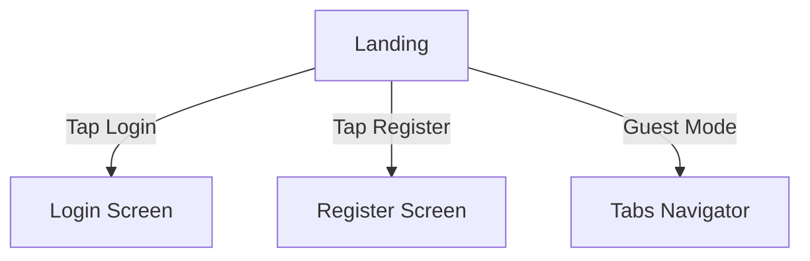

# Landing Screen

## Purpose
The Landing screen acts as the **entry point** of the app.  
It welcomes users and provides navigation options to:
- Login
- Register
- Explore products (if guest browsing is allowed)

## Responsibilities
- Display branding and call-to-action buttons.
- Redirect user to authentication flow (`Login`, `Register`).
- Possibly show promotional banners or featured products.

## Clean Architecture Mapping
- **Presentation Layer** → UI components (buttons, text, images).
- **Domain Layer** → No direct involvement here (just navigation).
- **Data Layer** → Not touched at this stage.

## Navigation Flow
