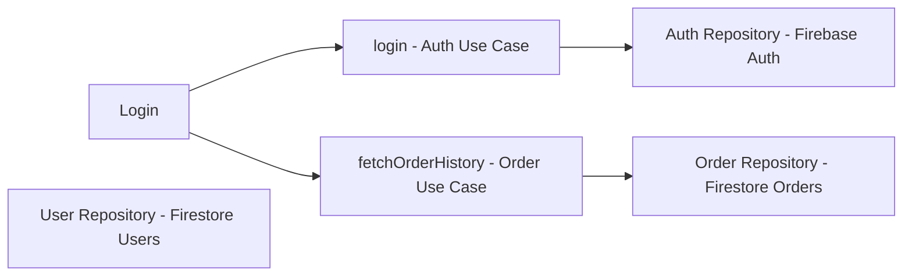

# Screen: Login

## Overview
The `Login` screen allows a user to sign into the ShopLab app using email and password.  
It also supports navigation to `ForgotPassword` and `Register` screens.  
This screen is part of the **Presentation Layer** in Clean Architecture.  
It communicates with **domain/use-case functions** (`login`, `fetchOrderHistory`) and updates the **Redux store**.

---

## Components / React Native Elements

| Component | Purpose |
|-----------|---------|
| `SafeAreaView` | Wraps screen content to avoid notches/status bar overlap |
| `TextInput` | Captures user email and password |
| `Pressable` | Handles user actions like sign-in button |
| `Text` | Displays clickable links ("Forgot password?" and "Sign up") |
| `ActivityIndicator` | Shows loading spinner during async operations |
| `View` | Layout container for buttons and spacing |
| `StyleSheet` | Styles for responsive layout using `wp`/`hp` |

---

## State Variables (Hooks)

| State | Purpose |
|-------|---------|
| `email` | Stores user input email |
| `password` | Stores user input password |
| `showIndicator` | Controls visibility of `ActivityIndicator` during login |

**Notes on Hooks:**
- `useEffect` listens for screen focus and resets email/password.
- `useDispatch` from Redux Toolkit updates user info and order history globally.

---

## Business Logic / Domain Layer

- **`signIn` function**:
  - Shows loading indicator (`showIndicator = true`)
  - Calls async `login(email, password)` from utility functions
  - On success:
    - Calls `fetchOrderHistory(email)`
    - Updates Redux store:
      - `setUserName`
      - `setUserEmail`
      - `setUserOrderHistory`
    - Navigates to `Tabs`
  - On failure: shows alert with error message

- **Navigation**:
  - `ForgotPassword` and `Register` are navigable links

---

## Clean Architecture Mapping

## Implementation Notes

- Uses `react-native-responsive-screen` for responsive layout (`wp`/`hp`)
- Shows `ActivityIndicator` during async operations
- Resets input fields when screen gains focus (`navigation.addListener('focus')`)
- Navigation handled via **React Navigation stack**
- Async calls are handled with `async/await`
- Redux Toolkit used for global state updates
- `window.alert` is temporary; can be replaced with custom modal
- Can be converted to TypeScript:
  - `navigation` typed with `NativeStackScreenProps<RootStackParamList, 'Login'>`
  - State variables typed as `string` or `boolean`

